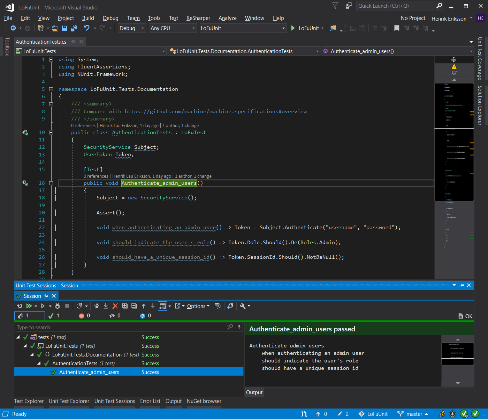
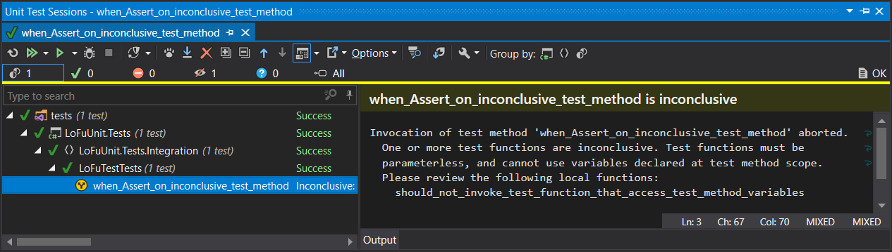
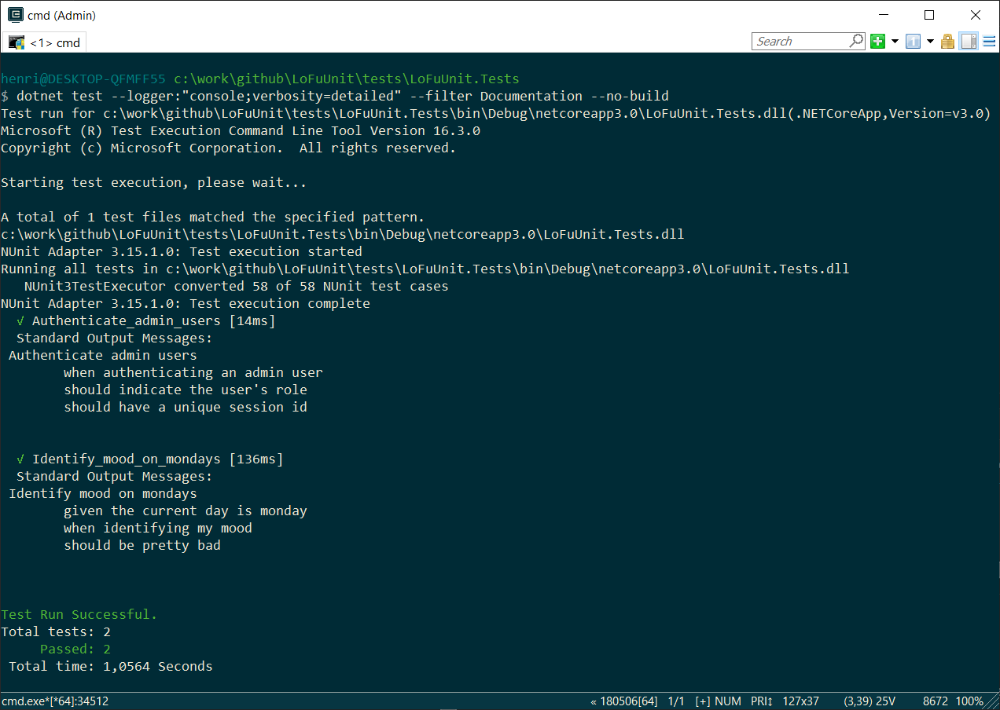

# LoFuUnit

[](https://ci.appveyor.com/project/hlaueriksson/lofuunit)
[](https://www.codefactor.io/repository/github/hlaueriksson/lofuunit)

[](https://www.nuget.org/packages/LoFuUnit)
[](https://www.nuget.org/packages/LoFuUnit.MSTest)
[](https://www.nuget.org/packages/LoFuUnit.NUnit)
[](https://www.nuget.org/packages/LoFuUnit.Xunit)

[](https://www.nuget.org/packages/LoFuUnit.AutoFakeItEasy)
[](https://www.nuget.org/packages/LoFuUnit.AutoMoq)
[](https://www.nuget.org/packages/LoFuUnit.AutoNSubstitute)

> Testing with **Lo**cal **Fu**nctions 🐯
>
> in .NET / C# ⚙️
>
> with your favorite **Unit** Testing Framework ✔️

## Content

- [Introduction](#introduction)
- [Testing](#testing)
  - [Packages 📦](#packages-)
  - [Tests ✔️](#tests-%EF%B8%8F)
  - [Output 📃](#output-)
  - [Limitations ❗](#limitations-)
  - [Inconclusiveness ⁉️](#inconclusiveness-%EF%B8%8F)
  - [Best Practices 👍](#best-practices-)
- [Auto Mocking](#auto-mocking)
  - [Packages 📦](#packages--1)
  - [Mocks 🦆](#mocks-)
  - [Limitations ❗](#limitations--1)
- [Results](#results)
- [Troubleshooting](#troubleshooting)
- [Attribution](#attribution)

# Introduction

Use the traditional Unit Testing Frameworks for **BDD**.

Use _local functions_ to structure tests with patterns like:

* `Arrange` / `Act` / `Assert`
* `Given` / `When` / `Then`
* `Context` / `Specification`

Use Auto-Mocking Containers to `Mock` / `Fake` / `Stub` dependencies.

LoFuUnit consists of a few packages that make it convenient for developers to write tests with _collaboration_ & _communication_ in mind.

Why LoFu?
`LoFu` stands for [Local Functions](https://docs.microsoft.com/en-us/dotnet/csharp/programming-guide/classes-and-structs/local-functions).

Why the tiger logo?
[老虎](https://translate.google.com/#view=home&op=translate&sl=zh-CN&tl=en&text=%E8%80%81%E8%99%8E) translates to _tiger_ in English and is pronounced [`lou5 fu2`](https://forvo.com/word/%E8%80%81%E8%99%8E/#yue) in Cantonese.

What are local functions?

> Starting with C# 7.0, C# supports local functions.

> Local functions are private methods of a type that are nested in another member.

> Local functions can use the `async` modifier.

# Testing

An example of a test with [LoFuUnit.NUnit](https://www.nuget.org/packages/LoFuUnit.NUnit/):

```csharp
using FluentAssertions;
using LoFuUnit.NUnit;
using NUnit.Framework;

namespace LoFuUnit.Tests.Documentation
{
    public class AuthenticationTests
    {
        SecurityService Subject;
        UserToken Token;

        [LoFu, Test]
        public void Authenticate_admin_users()
        {
            Subject = new SecurityService();

            void when_authenticating_an_admin_user() =>
                Token = Subject.Authenticate("username", "password");

            void should_indicate_the_user_s_role() =>
                Token.Role.Should().Be(Roles.Admin);

            void should_have_a_unique_session_id() =>
                Token.SessionId.Should().NotBeNull();
        }
    }
}
```

Output:

```txt
Authenticate admin users
	when authenticating an admin user
	should indicate the user's role
	should have a unique session id
```

Terminology:

* Test fixture – a class that contains tests
  * e.g. `AuthenticationTests`
* Test method – a method in a test fixture that represents a test
  * e.g. `Authenticate_admin_users`
* Test function – a local function in a containing test method, that does something along the lines of _arrange_, _act_ or _assert_
  * e.g. `when_authenticating_an_admin_user`, `should_indicate_the_user_s_role` and `should_have_a_unique_session_id`

## Packages 📦

README | Test Framework | NuGet | Sample
--- | --- | --- | ---
[LoFuUnit](LoFuUnit.md) | - | [](https://www.nuget.org/packages/LoFuUnit/) | [`LoFuUnit.Sample`](/samples/LoFuUnit.Sample)
[LoFuUnit.MSTest](LoFuUnit.MSTest.md) | MSTest | [](https://www.nuget.org/packages/LoFuUnit.MSTest/) | [`LoFuUnit.Sample.MSTest`](/samples/LoFuUnit.Sample.MSTest)
[LoFuUnit.NUnit](LoFuUnit.NUnit.md) | NUnit | [](https://www.nuget.org/packages/LoFuUnit.NUnit/) | [`LoFuUnit.Sample.NUnit`](/samples/LoFuUnit.Sample.NUnit)
[LoFuUnit.Xunit](LoFuUnit.Xunit.md) | Xunit | [](https://www.nuget.org/packages/LoFuUnit.Xunit/) | [`LoFuUnit.Sample.Xunit`](/samples/LoFuUnit.Sample.Xunit)

## Tests ✔️

Test fixtures can inherit the class `LoFuTest`.

Test methods can contain local functions that are invoked implicitly.
These test functions can perform the _arrange_, _act_ or _assert_ steps of the test.

The `LoFuTest` base class provides two important methods for test fixtures.
The `Assert` and `AssertAsync` methods invokes the test functions in the containing test method.
The invocations will probably occur in the order that the test functions are declared, but it's not guaranteed.
Do not write tests that depend on the order of test function execution.
If a test function fails, the test method fails directly.
Any subsequent test functions in the test method will not be invoked.
Make sure that all test methods actually invoke `Assert` or `AssertAsync`.

Test fixtures that does not inherit the `LoFuTest` base class can invoke the extension methods:

* `this.Assert();`
* `await this.AssertAsync();`

Test fixtures can also be implemented so `Assert` or `AssertAsync` is invoked for all test methods in a _tear down / cleanup / dispose_ method.

The `LoFuUnit.NUnit` package also contains the `[LoFuTest]` and `[LoFu]` attributes to mark test methods with.
This will automatically invoke `Assert` or `AssertAsync` when the test method runs.

Examples of all these patterns can be found in the [samples](/samples) folder.

Succinct test functions can be implemented as one-liners by
refactoring to _[expression body](https://docs.microsoft.com/en-us/dotnet/csharp/programming-guide/statements-expressions-operators/expression-bodied-members#methods)_
and omitting the [curly brackets](https://en.wikipedia.org/wiki/Bracket#Curly_brackets).

The naming of the test methods and test functions are important, because the names are the basis for the test output.

Remember:

* Do **not** explicitly invoke the test functions in a test method
* Only invoke the `Assert` or `AssertAsync` method **once** per test method

## Output 📃



The naming of the test methods and test functions determines the test output.

The naming convention is to use `snake_case` for test methods and test functions.

An underscore will be replaced by _space_ in the test output:

* `foo_bar` will be formatted as `foo bar`

Surrounding a word with double underscores will put _quotes_ around that word in the test output:

* `__Foo__` will be formatted as `"Foo"`

Suffixing a word with `_s_` will add _possessive_ form to the word in the test output:

* `Foo_s_` will be formatted as `Foo's`

Take the opportunity to invent your own convention for naming test methods and test functions.

Consider using keywords like:

* `given`
* `when`
* `then`
* `should`

What characters can be used when naming test methods and test functions?
[Stack Overflow](https://stackoverflow.com/a/950651/7042367) has the answer!

You can use the `Log` method from the `LoFuTest` base class to write custom messages to the test output.

The naming of `assemblies`, `namespaces` and `classes` can also make the test suite more readable in your test runner.

## Limitations ❗

**Rule #1**: Test functions must return `void` or `Task`

The `Assert` method can only invoke local functions that:

* are *synchronous* and returns `void`

The `AssertAsync` method can only invoke local functions that:

* are *synchronous* and returns `void`, or
* are *asynchronous* and returns `Task`

**Rule #2**: Test functions must be parameterless

The `Assert` and `AssertAsync` methods can only invoke local functions that:

* has no parameters

**Rule #3**: Test functions must **not** use variables declared at test method scope, i.e. local variables in the containing method (including its parameters)

The solution for this is to use test fixture [members](https://docs.microsoft.com/en-us/dotnet/csharp/programming-guide/classes-and-structs/members), e.g. fields, properties, methods etc.

When a test function needs access to data from the test method or another test function:

* use a variable declared at test fixture scope, i.e. a [field](https://docs.microsoft.com/en-us/dotnet/csharp/programming-guide/classes-and-structs/fields)

It is easy to break rule #3 by mistake, because:

> Note that all local variables that are defined in the containing member, including its method parameters, are accessible in the local function.

## Inconclusiveness ⁉️

Test functions that break these abovementioned rules can not be invoked when the test method is running.

The `Assert` and `AssertAsync` methods will first validate the local functions in the test method scope, before they are invoked.
If any violations of the rules are found, an `InconclusiveLoFuTestException` is thrown.
The exception includes a message with the local functions that should be reviewed.

With the `[LoFu]` and `[LoFuTest]` attributes in [LoFuUnit.NUnit](https://www.nuget.org/packages/LoFuUnit.NUnit/), the test runner clearly shows inconclusive tests:



## Best Practices 👍

A list of [Best Practices](BestPractices.md) with patterns to consider and avoid.

# Auto Mocking

An example of a test with [LoFuUnit.AutoNSubstitute](https://www.nuget.org/packages/LoFuUnit.AutoNSubstitute/) and [LoFuUnit.NUnit](https://www.nuget.org/packages/LoFuUnit.NUnit/):

```csharp
using System;
using FluentAssertions;
using LoFuUnit.AutoNSubstitute;
using LoFuUnit.NUnit;
using NSubstitute;
using NUnit.Framework;

namespace LoFuUnit.Tests.Documentation
{
    public class MoodTests : LoFuTest<MoodIdentifier>
    {
        string _mood;

        [LoFu, Test]
        public void Identify_mood_on_mondays()
        {
            void given_the_current_day_is_monday()
            {
                var monday = new DateTime(2011, 2, 14);

                Use<ISystemClock>()
                    .CurrentTime
                    .Returns(monday);
            }

            void when_identifying_my_mood() =>
                _mood = Subject.IdentifyMood();

            void should_be_pretty_bad() =>
                _mood.Should().Be("Pretty bad");
        }
    }
}
```

Output:

```txt
Identify mood on mondays
	given the current day is monday
	when identifying my mood
	should be pretty bad
```

## Packages 📦

README | Mock Framework | NuGet | Sample
--- | --- | --- | ---
[LoFuUnit.AutoFakeItEasy](LoFuUnit.AutoFakeItEasy.md) | FakeItEasy | [](https://www.nuget.org/packages/LoFuUnit.AutoFakeItEasy/) | [`LoFuUnit.Sample.AutoFakeItEasy`](/samples/LoFuUnit.Sample.AutoFakeItEasy)
[LoFuUnit.AutoMoq](LoFuUnit.AutoMoq.md) | Moq | [](https://www.nuget.org/packages/LoFuUnit.AutoMoq/) | [`LoFuUnit.Sample.AutoMoq`](/samples/LoFuUnit.Sample.AutoMoq)
[LoFuUnit.AutoNSubstitute](LoFuUnit.AutoNSubstitute.md) | NSubstitute | [](https://www.nuget.org/packages/LoFuUnit.AutoNSubstitute/) | [`LoFuUnit.Sample.AutoNSubstitute`](/samples/LoFuUnit.Sample.AutoNSubstitute)

## Mocks 🦆

`LoFuUnit` uses `AutoFixture` as Auto-Mocking Container.

Test fixtures that inherit the `LoFuTest<TSubject>` base class can use mocks.
The generic type parameter defines what kind of _subject_ under test to create.

The `Use<TDependency>` method creates a mock / dependency that the _subject_ is dependent upon.
Use the API from the mock framework to configure the behavior of the mock.

The `The<TDependency>` method returns a previously created mock.
Use the API from the mock framework to verify the interaction with the mock.

The `Subject` property returns an auto-mocked instance of the _subject_ under test.
Use the _subject_ for the `act` or `when` test steps.

The `Clear` method reset the Auto-Mocking Container, and clears the mocks and _subject_ under test.
Make test methods isolated from each other, by clearing the state between runs.
Test fixtures can also be implemented so `Clear`is invoked for all test methods in a _tear down / cleanup / dispose_ method.

The `Fixture` property is exposed to the test fixtures. Use it in scenarios where the methods described above are inadequate.
Consult the [AutoFixture documentation](https://github.com/AutoFixture/AutoFixture/wiki) for more information.

Examples of usage can be found in the [samples](/samples) folder.

## Limitations ❗

Before you can access a mock / dependency via the `The<TDependency>` method,
you must first call one of the `Use<TDependency>` methods for that specific type.
The `The<TDependency>` method will return `null` for unknown mocks / dependencies.

# Results

The test result output can be used as documentation.

With the [`dotnet test`](https://docs.microsoft.com/en-us/dotnet/core/tools/dotnet-test) command, the output can be captured via:

```bat
dotnet test --logger:"console;verbosity=detailed"
```



```bat
dotnet test --logger:trx
```


# Troubleshooting

If you see something like this:

```
LoFuUnit.InconclusiveLoFuTestException : Invocation of test method 'when_Assert_on_inconclusive_test_method' aborted. One or more test functions are inconclusive. Test functions must be parameterless, and cannot use variables declared at test method scope. Please review the following local functions:
	should_not_invoke_test_function_that_access_test_method_variables
   at LoFuUnit.LoFuTest.ThrowInconclusive(MethodBase method, IEnumerable`1 names) in C:\work\github\LoFuUnit\src\LoFuUnit\LoFuTest.cs:line 146
   at LoFuUnit.LoFuTest.Validate(MethodBase method) in C:\work\github\LoFuUnit\src\LoFuUnit\LoFuTest.cs:line 118
   at LoFuUnit.LoFuTest.Assert(Object testFixture, MethodBase testMethod) in C:\work\github\LoFuUnit\src\LoFuUnit\LoFuTest.cs:line 41
   at LoFuUnit.LoFuTest.Assert() in C:\work\github\LoFuUnit\src\LoFuUnit\LoFuTest.cs:line 24
   at LoFuUnit.Tests.Integration.LoFuTestTests.when_Assert_on_inconclusive_test_method() in C:\work\github\LoFuUnit\tests\LoFuUnit.Tests\Integration\LoFuTestTests.cs:line 89
```

Then you broke Rule #2 or #3, described above.
Make sure that the local functions do not have any parameters.
And furthermore, that the local functions do not access any variables declared in the containing method.
Rewrite the test so that data is passed to the local functions via fields declared in the containing class.

If you see something like this:

```
LoFuUnit.InconclusiveLoFuTestException : Invocation of test function 'should_not_invoke_async_test_function_that_returns_void' failed. The asynchronous local function does not have a valid return type. Asynchronous test functions must return a Task, and cannot return void or Task<TResult>.
   at LoFuUnit.LoFuTest.AssertAsync(Object testFixture, MethodBase testMethod) in C:\work\github\LoFuUnit\src\LoFuUnit\LoFuTest.cs:line 84
   at LoFuUnit.LoFuTest.AssertAsync() in C:\work\github\LoFuUnit\src\LoFuUnit\LoFuTest.cs:line 36
   at LoFuUnit.Tests.Integration.LoFuTestTests.when_AssertAsync_on_invalid_test_function() in C:\work\github\LoFuUnit\tests\LoFuUnit.Tests\Integration\LoFuTestTests.cs:line 129
   at NUnit.Framework.Internal.TaskAwaitAdapter.GenericAdapter`1.GetResult()
   at NUnit.Framework.Internal.AsyncToSyncAdapter.Await(Func`1 invoke)
   at NUnit.Framework.Internal.Commands.TestMethodCommand.RunTestMethod(TestExecutionContext context)
   at NUnit.Framework.Internal.Commands.TestMethodCommand.Execute(TestExecutionContext context)
   at NUnit.Framework.Internal.Commands.BeforeAndAfterTestCommand.<>c__DisplayClass1_0.<Execute>b__0()
   at NUnit.Framework.Internal.Commands.BeforeAndAfterTestCommand.RunTestMethodInThreadAbortSafeZone(TestExecutionContext context, Action action)
```

Then you broke Rule #1, described above.
Make sure that the `async` local functions does not return `void`.
Rewrite the test so that the asynchronous local functions return a `Task`.

# Attribution

LoFuUnit is standing on the shoulders of giants.

It is inspired by https://github.com/machine/machine.specifications and https://github.com/machine/machine.specifications.fakes

It builds upon:

* https://github.com/nunit/nunit
* https://github.com/xunit/xunit
* https://github.com/Microsoft/testfx
* https://github.com/AutoFixture/AutoFixture
* https://github.com/FakeItEasy/FakeItEasy
* https://github.com/moq/moq4
* https://github.com/nsubstitute/NSubstitute
